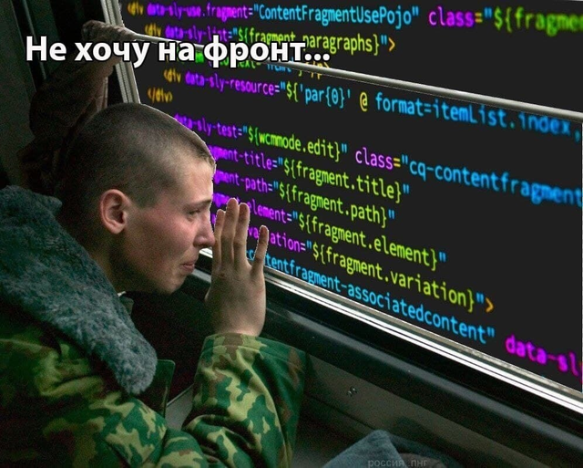
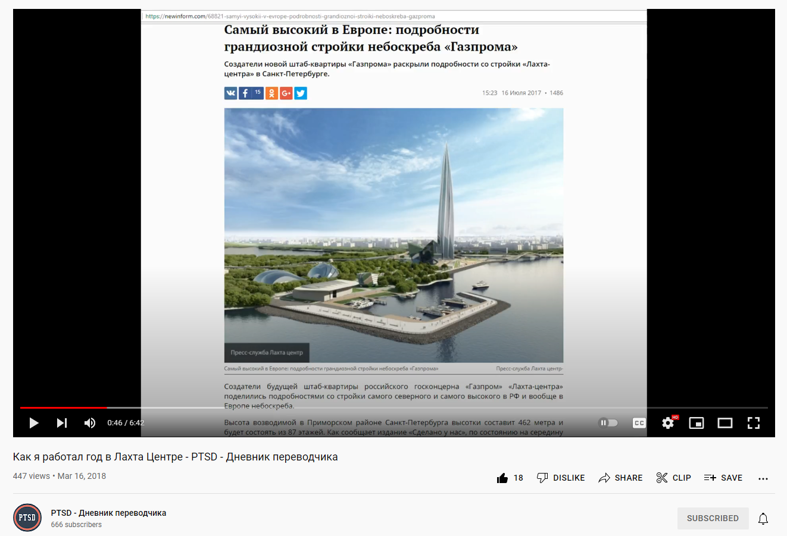
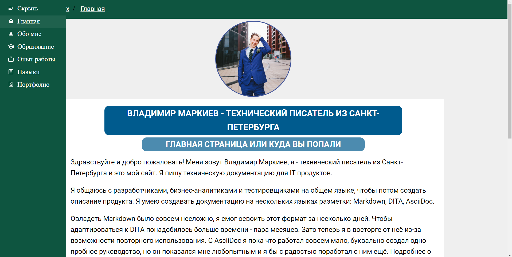

# Docsvision TRD Prod — как я не стал фронтэндером, а стал техническим писателем

*Docsvision TRD Prod = **T**echnical w**R**iter **D**ays in **Prod**uction в компании Docsvision. Даже не спрашивайте, как моё воображение породило эту аббревиатуру.*

Всем привет! Меня зовут Владимир Маркиев, но вы можете звать меня просто Авксентий Цезаревич. Я работаю техническим писателем в компании Docsvision, люблю документацию и представляться чужими именами в статьях на хабре.

У меня гуманитарное образование переводчика, а опыт работы техническим писателем составляет всего два года (и то неполных). Я хочу рассказать, как можно войти в IT с гуманитарным образованием, и насколько это тяжело.

## О чём пойдёт речь

В статье я рассказал о своём опыте и на его примере дал некоторые советы новичкам:

- Почему выбрал гуманитарное образование, а не сразу пошёл в IT
- Кем работают гуманитарии
- Что ждёт в IT (увольнение через месяц)
- Кто такой технический писатель пис и айтишник ли он
- Взгляд на коллег и компанию
- Боли технического писателя

## Почему гуманитарное образование

В школе я всегда был более дружен с компьютером, чем с одноклассниками. Когда у нас только появился интернет, я проявлял интерес к фронтэнд-разработке. Тогда я написал свой сайт, используя шаблоны HTML и CSS. Добавил туда свои картинки и текст. На сайте даже была отдельная страница про НЛО в чёрно-зелёных тонах.

Если вы мечтаете о карьере в IT, попробуйте вспомнить, вдруг вы баловались чем-то подобным ради забавы. Самое время вспомнить и освежить навык.

Поступи я после школы какое-нибудь ИТМО, сейчас был бы на фронте. Ну, фронтэндером в смысле. Но тогда я и не подозревал о существовании IT-сферы, тем более, что этому где-то учат.

Мне всегда нравился английский, я хотел быть переводчиком. Поэтому пошёл в выборгский филиал РГПУ, где из меня сделали филолога. Не фронтендер, но close enough.

## Кем работают гуманитарии

Вопреки расхожему мнению не все гуманитарии работают на кассе в Мак.. Вкусно — и точка.

Моей первой работой был Лингваториум — это такой проект, который позволяет научиться английскому при помощи разнообразных автоматически сгенерированных упражнений.

На самом деле даже из такого опыта можно сделать резюме айтишника. Всё зависит от того, как подать опыт. Можно сказать: "я создавал упражнения для студентов", а можно: "мне потребовалось разобраться со сложной системой и адаптировать контент для работы в лингвистическом тренажёре". Выглядит как стандартный совет по составлению резюме, но это правда работает. Для начала карьеры — идеально.

Потом я поступил в ФИНЭКовскую магистратуру на перевод, подрабатывая фриланс-переводами. Едва ли можно заработать на фриланс переводах что-то достойное, но я не сдавался.

Через два года я закончил магистратуру, поступил в аспирантуру, но взял академ, потому что нашёл отличную работу переводчиком. Переводил техническую документацию на стройке Лахта-центра.

Проработал в токсичной и абьюзерской атмосфере год, после чего ушёл.

Такой опыт — шикарная строчка для резюме технического писателя. Если вам на профессиональном пути потребуется создавать документацию по ГОСТ с отступами и полями, то вы будете ознакомлены с требованиями, с языком и основной структурой. Даже если документация была не для IT-продукта, опыт работы со сложными текстами всегда будет плюсом.

Тогда же я запустил свой [ютюб-канал](https://www.youtube.com/channel/UC_n20vgzZheV8dLhOfzlczA) про переводческую деятельность с настолько плохим качеством графики, что это даже было смешно.

Как можно понять из названия канала, я всегда любил странные аббревиатуры.

Аспирантуру я так и не закончил. Поработал годик в одной компании менеджером по ВЭД, но по сути мои обязанности сводились к переводу видеоконференций и писем от иностранных партнёров.

Брошенная аспирантура может плохо сыграть в резюме. Если спросят, лучше сказать честно "мне не понравилось, что акцент не на исследовательской деятельности, а на преподавании".

## Что ждёт в IT (увольнение через месяц)

После увольнения с предыдущей работы у меня случился кризис, я думал, что я ни к чему не пригоден. Но мне нравилось переводить технические тексты, всегда нравилось разбираться в деталях.

Как-то раз за беседой с одним знакомым прозвучала фраза "а ты не думал стать техническим писателем, тебе бы подошло". Я загорелся идеей, начал читать, изучать вакансии, требования. Но никто не отвечал на отклики.

Не стоит бросать попытки, если отклики не приносят результата. Спрашивайте обратную связь каждый раз. Любой ответ помогает понять, на что следует обратить внимание. Если совсем нет ответов на отклики, возможно пора получить новые навыки, подтянуть существующие или найти родственную профессию, чтобы поддержать свой доход.

Я решил пойти в копирайтеры. Это же почти то же самое, что технический писатель (нет). Не знаю, что меня дёрнуло. Компания на фасад выглядела классно: современный открытый офис, приятные рабочие места. Ну всё! Теперь я в айти, кругом разработчики, а я буду крутиться среди них и тоже стану крутым.

Проблемы начались сразу при оформлении:

- Серая на 2/3 зарплата, к тому моменту я устал от серой з/п.
- Оформить не могли неделю, тянули с подписанием документов.
- Задачи и обязанности не были понятны. Не было вводного инструктажа, не было понятно, для чего я делаю свою работу и где посмотреть результат.

Я креативил и генерил идеи изо всех сил... на протяжении одного месяца. А потом меня уволили без объяснения причин. Об увольнении я узнал по "третьей за месяц зарплате" с подписью "расчёт при увольнении". Первая попытка стать айтишником провалилась.

Ещё одна строчка, которая не украсит резюме. Во-первых, можно её не указывать, потому что это слишком маленький период. Во-вторых, всегда можно объяснить причину. В-третьих, обязательно использовать этот опыт в свою пользу. Я работал с YouTrack, Markdown, работал с IT-продуктом и писал околоайтишные тексты как, например, политика использования персональных данных.

Когда меня уволили из той компании, я решил заняться своим портфолио и по-настоящему углубиться в изучение профессии техписа. Я нанялся к Selectel по договору ГПХ писать технические статьи. Это тройной профит: таким образом я повышал свою подкованность в сфере информационных технологий, нарабатывал портфолио и подрабатывал. Писал про сетевую модель, про гит, LVM.

Также я создал [свой сайт](https://vladimir-markiev.name/), написал его с нуля на простом HTML и CSS. Гораздо лучше, чем мой первый сайт, когда я учился в школе.

Первая версия сайта выглядела похуже, это уже вторая редакция, но и она уже не совсем актуальна и не устраивает меня. Сделать третью всё руки не доходят.

Такая подготовка повышает шансы быть замеченным. Мне это помогло получить сразу несколько офферов. Я искал работу, чтобы стать техническим писателем и в результате даже пришлось выбирать между двумя очень хорошими предложениями.

## Кто такой техпис, он вообще айтишник?

Технический писатель создаёт документацию для IT-продуктов. Техпис может создавать документацию, например, в ворде или использовать специальные инструменты, языки разметки и прочее.

Может показаться, что это какая-то ерунда, но, чтобы заниматься документацией, нужен особый склад ума и характера. Нужно также уметь общаться на языке разработчиков и создавать из этого документацию.

Технический писатель — это профессия на стыке, она во многом сходна с переводческой деятельностью. Технический писатель должен не только понимать, что говорят разработчики, но и уметь ставить себя на место простого пользователя, администратора или даже разработчика. То есть как минимум понимать код — обязательное требование. Некоторые техписы также тестируют соответствие документации реальности.

К сожалению, образование технического писателя нельзя получить в каком-то официальном ВУЗе. Можно либо пройти обучение на платных курсах, либо самостоятельно прийти в профессию.

Выбирать всегда сложно: а вдруг то, другое предложение, которое не выберешь, окажется лучше. Я выбрал Docsvision и не пожалел. Компания уже прошла путь от документации в ворде и теперь всё по-взрослому:

- docs as code в формате DITA
- исходники загружаются в git
- DITA-файлы конвертируются в PDF

Если вы только начинаете свой путь, то на собеседовании будет очень уместно спросить про docs as code, текущий формат документации, а также git. При условии, что вы сами разбираетесь в вопросах.

Не прошло и года, как мне поставили задачу исследовать возможность перевести документацию в новый формат. Сделать разделение на версии, вывести в онлайн, прикрутить свквозной поиск.

Что из этого получилось, я уже писал в предыдущих статьях:

- Как я переносил документацию из DITA в AsciiDoc+Antora ([1 часть](https://habr.com/ru/post/589457/) и [2 часть](https://habr.com/ru/post/592477/)).
- Сравнивал [возможности DITA и AsciiDoc](https://habr.com/ru/post/657977/).
- [Улучшал](https://habr.com/ru/company/docsvision/blog/693832/) навигацию для сайта.

## Общение с коллегами

Из личного опыта я сделал вывод, что и в сфере ИТ можно встретить неадекватных людей, но, как правило, коллеги — люди более открытые.

В DV крутым оказался не только подход к документации, но и сотрудники. По сравнению с любым коллективом, коллеги Docsvision — это настоящая семья. Все относятся друг к другу с дружелюбием и уважением. Любой сотрудник может обратиться к любому и получить адекватный ответ, без агрессии или подтекста.

Человеку без опыта разработки, коллеги-разработчики могут показаться олимпийскими чемпионами. За спринт успевают написать код, объединить фронтэнд и бэкэнд, а потом представить наработки всему отделу или всей компании.

## Боли технического писателя

У нашего продукта более двух тысяч страниц документации, включая руководства по установке, использованию и описание API.

Есть мнение, что технический писатель обязан знать продукт наизусть и даже уметь проверить написанное на достоверность.

Всё о системе знает только системный архитектор, многое нельзя проверить без специальной настройки или, не заходя в код. Я проверяю только то, что получается, когда делаю скрины для документации. Тестированием продукта занимается команда тестировщиков. Документация — часть продукта.

Бывает немного обидно, когда кто-нибудь сообщает об ошибке в документации. Нужно научиться воспринимать такие ошибки как потенциал для улучшения, а не как что-то личное. Коллеги могут найти ошибки как в недавней документации, которую писал я (виноват), так и в довольно старой, которую писал не я (виноват, что не проверил).

Среди ошибок в документации можно выделить следующие:

- опечатки (предлог задублировался или остался лишний после переформулировки)
- грамматические (бес попутал, в результате слово не так написал)
- пунктуационные (лишние или недостающие тире, запятые)
- смысловые (неправильная ветка реестра для настроек кэширования)

Бывает и так, что я сам нахожу ошибки или опечатки и исправляю их.

Я уже предвкушаю, как какой-нибудь комментатор пишет "как можно выпускать документацию с ошибками, это отвратительно". Всякое бывает, не то чтобы это критичные ошибки, учитывая, что появляются они несколько раз в месяц. Стараюсь воспринимать их как потенциал для улучшения.

## Вместо итога

Сменить область деятельности просто так сложно. Путь от гуманитарного образования до сферы информационных технологий может быть сложным и требовать работы над собой, над складом мышления, выбирать свою нишу методом проб и ошибок. Но старания оправданны, если это именно то, чего вы хотели достичь.

Разумеется, мне интересно программирование, я хочу выучить хотя бы Javascript на базовом уровне, но и профессия технического писателя мне тоже очень нравится. Я не разочаровался в своём выборе.

А с каким образованием вы пришли в IT? 

P.S.

Есть такой стереотип, что все айтишники носят бороды. Но я не видел таких стереотипичных айтишников с бородой у нас в компании или в других. Да и у самого борода как не росла раньше, так и не начала расти.