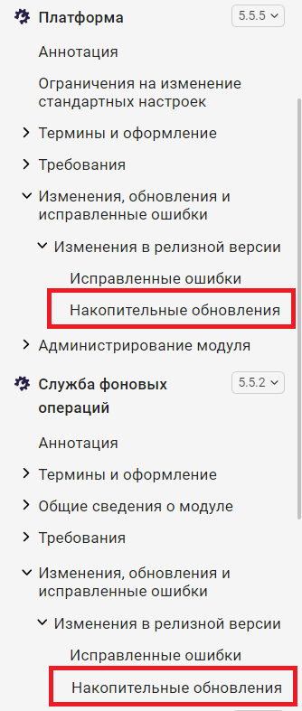
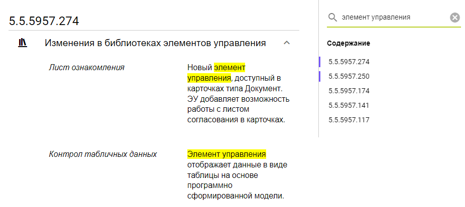
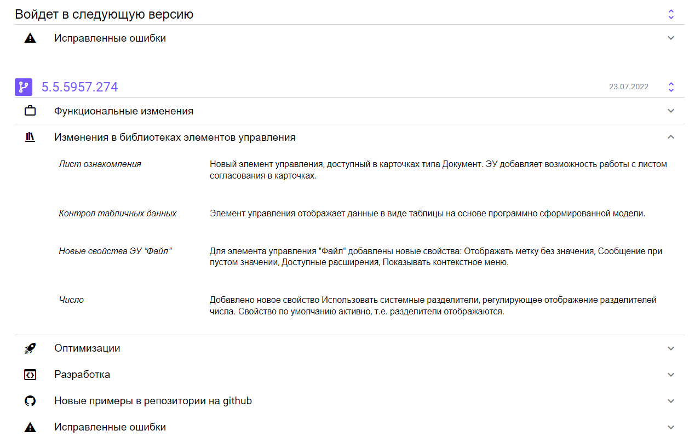
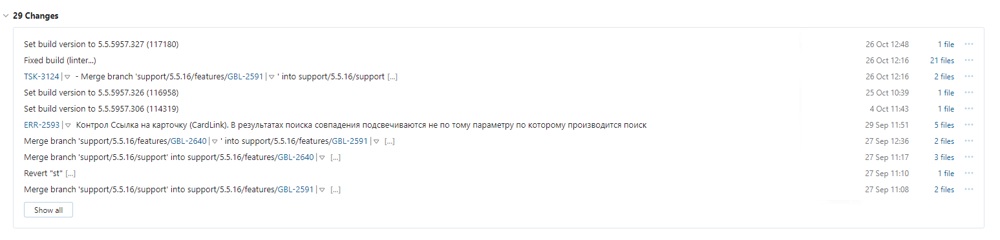
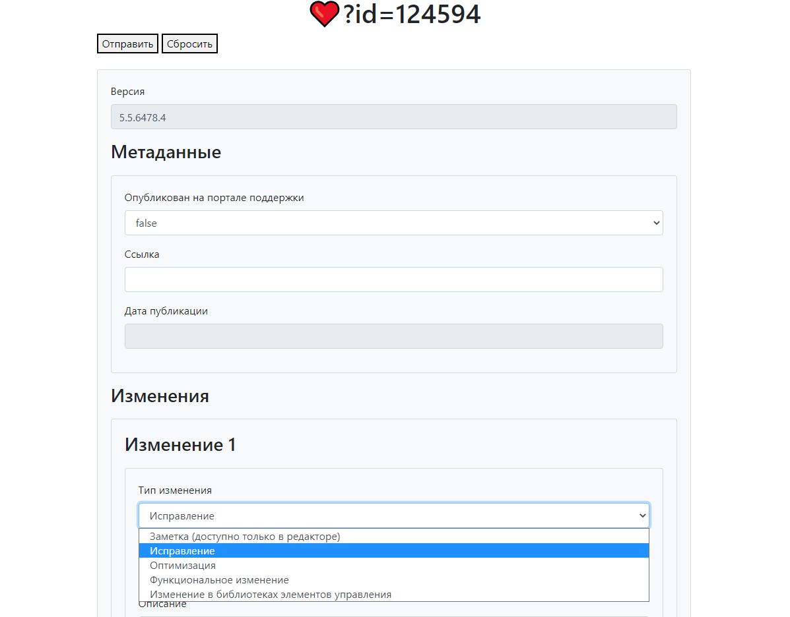
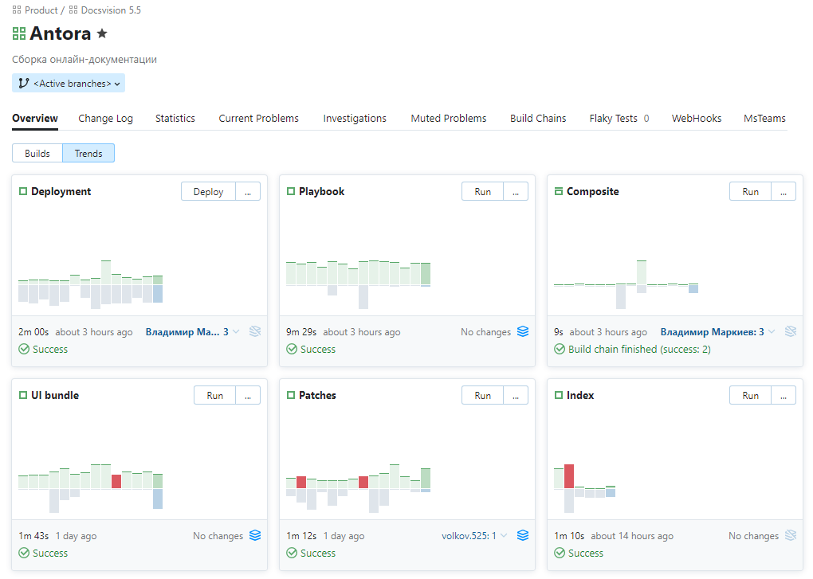

# На старт, внимание, патч! Как реализовать онлайн-докментацию для накопительных изменений.

Привет читателям! Меня зовут Александ Сергеевич, я — технический писатель в компании Docsvision. Когда мы создавали [онлайн-документацию Docsvision](https://habr.com/ru/post/592477/) при помощи Antora, перед нами стояла задача оставить место, куда в будущем будем интегрируется список накопительных изменений.

Подходящий момент для интеграции появился после того, как мы [подготовили сайт документации](https://habr.com/ru/company/docsvision/blog/693832/) к релизу. Эта работа обернулась интересным опытом внутрикомандного взаимодействия, которым я сегодня поделюсь.

## Задачу в студию!

Накопительные изменения — это, когда после релиза продукта, мы выпускаем для него исправления по запросу через техподдержку. От клиента приходит запрос на исправление, разработчик правит код, делает коммит, оставляет в нём сообщение. Это сообщение мы выбрали для отображения в списке накопительных изменений.

Требование звучало как "страница должна быть частью сайта, смотреться органично и быть интегрирована в процесс сборки". Сколько нужно айтишников, чтобы выполнить требование? Ровно трое: один техписатель, один дизайнер и один инженер по конфигурации.


Посовещавшись втроём, мы решили, что так как я пишу документацию в формате AsciiDoc, AsciiDoc преобразовывается в HTML при помощи генератора статических сайтов Antora, страница должна быть сформирована также при помощи Antora. Получить списСборка сайта и накопительных обновлений настроена через TeamCity, поэтому и сборка страницы должна будет проводиться через TeamCity. Страница должна получать список изменений и быть оформлена по красоте. 

Это ставит задачу для каждого участника:

- Задача технического писателя — добавить страницу со всеми ресурсами на сайт.
- Задача дизайнера — оформить фронтэнд страницы: стили, поиск, группировка по категориям изменений.
- Задача инженера по конфигурации — настроить TeamCity так, чтобы поддерживалась одновременно сборка сайта, сборка исправлений и добавление списка изменений на сайт.

## Встроить, но не смешивать — задача для техписателя

Моя задача — добавить страницу на сайт, то есть необходимо:

- Создать страницу
- Сделать её максимально нейтральной
- Отобразить на сайте



Задача ясна, добавляю пустую страницу, а в неё один атрибут и заголовок:

```asciidoc
:page-layout: patches

= Накопительные обновления
```

Одной страницы мало, нужно добавить для неё эксклюзивные скрипты и стили. Эксклюзивность задаёт атрибут, который укажет Анторе, что нужно использовать специальный шаблон страницы. Шаблон сам не появится, его тоже нужно создать.

Я создал специальный шаблон, взяв за основу стандартный из репозитория [пользовательского интерфейса](https://github.com/Docsvision/antora-ui-default) Antora.

Добавил в`<head>` этой страницы две новые строки для стиля и для скрипта:

```html
<link rel="stylesheet" href="{{{uiRootPath}}}/css/vendor/patches.min.css">
<script type="module" crossorigin src="{{uiRootPath}}/js/vendor/patches.min.js"></script>
```

JavaScript, будет обращаться к базе за списком накопительных изменений и добавлять их на страницу. Этим занимался наш дизайнер.

## Вперёд на фронт!



Задача для дизайнера была поставлена следующим образом:

- Применить сквозной поиск по всем изменениям
- Страница должна иметь дружелюбный интерфейс, понятную и удобную древовидную структуру

Разумеется, решить задачи необходимо было в сжатые сроки. 

Сквозной поиск был реализован благодаря использованию Vue 3 для создания и вывода HTML на страницу. Фреймворк позволил искать изменения на странице прямо из браузера, без запросов к серверу.

Дружелюбный интерфейс дизайнер реализовал с помощью Quasar. Предоставляемые фреймворком готовые Vue-компоненты вроде распахивающихся панелей, полей ввода, кнопок, иконок также позволили решить задачу в сжатые сроки.

Сложнее всего было создать древовидную структуру, преобразовав плоский список от сервера в древовидную структуру, ведь на странице плоский список должен быть сгруппирован по релизам и типам исправлений.

Для этой задачи дизайнер использовал TypeScript: преобразовать данные в массив релизов, состоящий из дочерних массивов, поместить в массивы ошибки, оптимизации, функциональные и другие накопительные изменения.

Собрать проект помог Vite.js.

Получившийся код приходилось примерять семь раз, отрезать лишние строки в скрипте или конфликтующие стили в CSS пришлось тоже семь раз. Отдельным видом развлечения была игра в детективов, чтобы выявить мешающие строки. Классика.



## К слову о сервере

Всю серверную часть взял на себя наш инженер по конфигурации. Его задачами было:

- Создать сервис для хранения изменений
- Добавить редактор для редактирования описаний изменений
- Настроить конфигурацию сборки проекта 

Накопительные изменения хранятся в базе данных, а из неё попадают на страницу сайта, которая похожа на все остальные.



Сервис хранит информацию в БД SQLite. В БД изменения попадают, когда разработчик делает коммит в репозиторий. Это запускает сборку продукта в TeamCity, TeamCity отправляет POST запрос, в теле которого передает идентификатор продукта, идентификатор сборки, версию и массив вошедших изменений. Если сборка была опубликована на портале технической поддержки, сервис включит в неё изменения предыдущих сборок, которые не были опубликованы на портале. Информация из запроса позже попадёт в контейнерный сервис и в БД.

Пример информации от TeamCity:

```json
{
  "Id": 117188,
  "ProductId": 1,
  "FileVersion": "5.5.5957.327",
  "Changes": [
    {
      "Title": "ERR-2471",
      "Description": "Диалог атрибутивного поиска. Заменить кебаб на крестик",
      "Type": 1
    },
  ]
}
```


[//]: # (Не всегда получается что-то исправить с первого раза, в истории изменений один и тот же номер YouTrack может встречаться несколько раз и входить в разные сборки. Когда TeamCity делает POST запрос, происходит проверка, не было ли это исправлено в предыдущих сборках этого продукта. Если было, у предыдущих записей меняется тип на Заметка &#40;0&#41;, а Исправление &#40;1&#41; остаётся только у последнего.)

## Что написано пером, то можно изменить в редакторе

Информация в БД не высечена из камня, если у коммита слишком жаргонное сообщение, его можно отредактировать через специальный редактор.



Редактор позволяет выбрать тип изменения, отредактировать описание или перенести изменение в заметки, чтобы оно не отображалось на сайте и носило чисто информативный характер. Редактор — последний шаг разработки, оставалось только автоматизировать процесс сборки всего проекта.

## Цепочка сборки



Мы сформировали цепочку сборки документации из 5 конфигураций:

- **Composite** — запускает цепочку сборки, проверяет изменения в репозиториях документации.
- **Patches** — собирает стили и скрипты для страницы со списком накопительных изменений.
- **UI bundle** — собирает пользовательский интерфейс сайта, забирает ресурсы из **Patches**.
- **Playbook** — собирает сайт, используя **Patches** и **UI bundle**.
- **Deployment** — обновляет сайт, заменяет контейнер с nginx, в котором он лежит.

При запуске проверяются изменения в предыдущих конфигурациях цепочки, если какую-то конфигурацию можно не собирать повторно, она собрана не будет.

После автоматизации мы выпустили созданную страницу в онлайн-документацию, где теперь каждому удобно посмотреть список накопительных изменений.

## Заключение

Таким образом на сайте появляется самая свежая документация, которая включает основной раздел и раздел с описанием накопительных изменений. Если возникнет потребность что-то изменить в сайте или документации, то изменения появятся на сайте в течение 10 минут после коммита.

Опыт сотрудничества технического писателя, дизайнера и инженера по конфигурации в рамках одной задачи — определённо весомый вклад в усиление командного взаимодействия.
