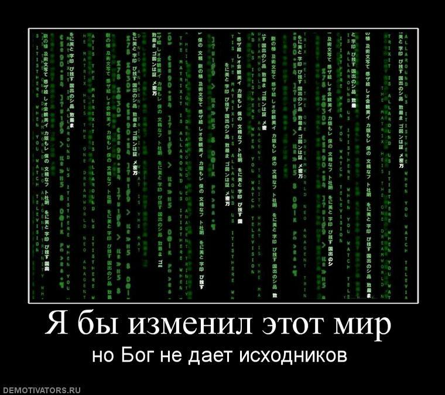
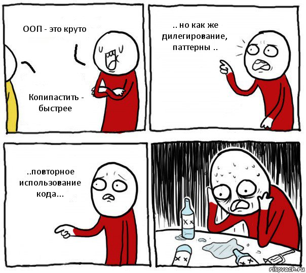
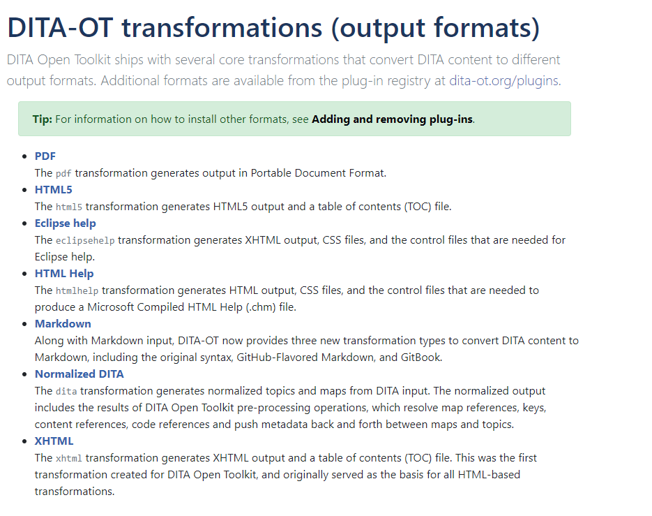
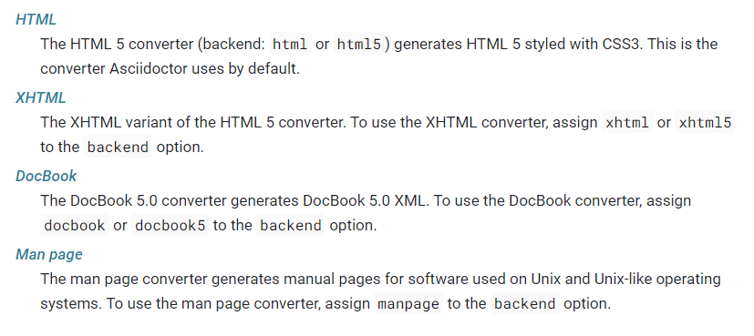
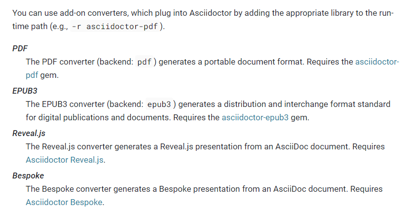

# Сравнение возможностей AsciiDoc и DITA

Всем лучи добра! Меня зовут Владимир Маркиев, я -- технический писатель в [Docsvision](https://docsvision.com/). Расскажу вам о двух Docs as Code инструментах. На случай если вы делали документацию в ворде или ещё где-то, а теперь решили отделить форматирование от документации и захотели "чтобы было чисто!". Побуду сегодня вашим Мистером Пропером.


Кто-то сейчас такой: "О, docs as code! Знаю-знаю, Дита!"
Я скажу: "падажжи, чё скажу!" Есть ещё AsciiDoc. 
Расскажу чё это за зверь такой и немного сравню два формата.

Когда я только пришёл в компанию, наша документация была на DITA. Но потом мы решили модернизировать документацию, вывести в онлайн, чтобы была разбивка на версии, чтобы всё было красиво и т.д. и т.п. Подробнее можно прочитать вот [здесь](https://habr.com/ru/post/589457/) и вот [тут](https://habr.com/ru/post/592477/). 

То есть я работал с Дитой и я работал с AsciiDoc, поэтому в какой-то степени могу судить и сравнивать. Сравню аналогичные функции, расскажу об отличиях, плюсах и минусах каждого формата и т.д. Короче, всё чётко и по понятиям, как это делают у нас в Купчино.

## Документация

**DITA**

Нельзя стать священником, не прочитав библии.


В случае Диты библия - это [стандарт](http://docs.oasis-open.org/dita/dita/v1.3/dita-v1.3-part3-all-inclusive.html), задокументированный чуть больше, чем полностью. Но нужно быть психом, чтобы втыкать в целый стандарт.

К счастью, есть Евангелие от Radu Coravu - [документация](https://www.oxygenxml.com/dita/styleguide/webhelp-feedback/index.html#Artefact/Authoring_Concepts/c_About_the_Style_Guide.html) от создателей Oxygen. Oxygen - Это основной инструмент для работы с Дитой, но об этом позже.

Хочется чего-то более человечного? Есть свободное толкование библии с примерами - [Learning Dita](https://learningdita.com/). Очень помогло, когда я хотел лучше понять Диту.

**AsciiDoc**

Есть только одна библия - сайт [docs.asciidoctor](https://docs.asciidoctor.org/). На сайте задокументирован весь синтаксис с очень удобной рубрикацией. Не знаете, как это сделать? Используйте поиск оп сайту.

Есть ещё несколько мест, на которых можно найти документацию, но они либо неофициальные, либо устаревшие.

Я далеко не сразу нашёл Docs.AsciiDoctor. Кто победил? Пусть будет ничья.

***DITA:AsciiDoc 1:1***

## Работа с исходниками




**DITA**

Исходники - обычный текст, который можно редактировать в блокноте. Проблема в том, что это XML с очень строгой структурой.

Иными словами: нужно иметь стальные... нервы, чтобы писать на дите в блокноте.

**AsciiDoc**

AsciiDoc - по большей части текст, который легко читается и пишется даже в самых простых текстовых редакторах. Даже в блокноте можно писать без особых трудностей.

Иными словами: писать в блокноте можно без проблем.

***DITA:AsciiDoc 1:2***

## Редакторы для работы с исходниками


**DITA**

Для Диты есть одна основная утилита - Oxygen. Это коммерческая и платная утилита. Есть ещё несколько утилит, но, честно говоря, они не очень удобные. Oxygen - это всё же канон. И стоимость у него каноничная.

А ещё новая версия несовместима со старой лицензией. Ну, разумеется.

**AsciiDoc**

Официального или единого редактора не существует. Но есть несколько редакторов, которые поддерживают AsciiDoc при условии установки плагинов:

- [Atom](https://atom.io/) - не пробовал, но выглядит норм, [много плагинов](https://atom.io/users/asciidoctor).
- [Visual Studio Code](https://code.visualstudio.com/) - с [плагином](https://marketplace.visualstudio.com/items?itemName=asciidoctor.asciidoctor-vscode) AsciiDoc поддерживает синтаксис и большую часть функций. 
- [IntelliJ Idea](https://www.jetbrains.com/idea/) - [плагин](https://plugins.jetbrains.com/plugin/7391-asciidoc) поддерживает максимум функционала и постоянно обновляется.
- [AsciidocFX](https://asciidocfx.com/) - утилита для работы с синтаксисом AsciiDoc. Поддерживает синтаксис.

Все утилиты для работы с Asciidoc абсолютно бесплатны.

***DITA:AsciiDoc 1:3***

## Функционал

### Повторное использование



**DITA**

Все любят Диту за повторное использование кода. 

Можно использовать целые топики или любые фрагменты. Но несть ограничения в зависимости от разрешённых элементов. Oxygen не даст заимствовать запрещённые элементы, так что ошибиться сложно.

Заимствования делаются при помощи `conref` или `conref ... conrefend`. Заимствовать один элемент или топик полностью - `conref`. Заимствовать от и до - `conref ... conrefend`.

**AsciiDoc**

Механизм повторного использования аналогичен Дите. Заимствовать один элемент или топик целиком - `include::topic.adoc[]`. Заимствовать от и до чуть сложнее. Нужно создать два тэга:

```asciidoc
//tag::magic-tag[]
Бла-бла-бла
//end::magic-tag[]
```

Затем заимствовать по тэгу: `include::topic.adoc[tags=magic-tag]`.

***DITA:AsciiDoc 2:4***

### Ключи


**DITA**

Сначала ключ нужно обозначить, затем задать ему значение, потом использовать его в нужных местах. Сделать это вне Oxygen будет очень сложно. Мне сложно сделать это даже в Oxygen, придётся рыться в заметках. Если честно, проще не использовать ключи. 

Зато для каждого ключа можно задать аудиторию, область действия и другие атрибуты.

**AsciiDoc**

Здесь ключи называются атрибутами, но суть та же. Определяешь в топике, потом используешь. Задаются атрибуты очень просто: `:attribute: значение`. Использовать через `{attribute}`, что заменится на "значение".

Область действия задать тоже можно, но не так просто в чистом AsciiDoc. Удобнее использовать Antora - генератор статических сайтов для AsciiDoc. Если не нужен сайт, то область действия ключей будет только в рамках топика или "карты".

***DITA:AsciiDoc 3:5***

### Профили и фильтрация

**DITA**

Даже если вы знакомы с Дитой на уровне "знакомый по пьяни рассказывал", вы должны были слышать о невероятно крутом механизме профилирования.

На пальцах: это когда создаётся один документ на 15 страниц исходников. 

Да, такой небольшой документ.


Из этих 15 страниц одной командой мы делаем три документа по 5 страниц каждый. При этом инструмент понимает сам, какие 5 страниц идут куда и добавляет к каждому титульный лист и все остальные части. 

Вот для этого в Дите есть специальные пометки - профили, .ditaval файлы. В Дите это делается очень легко и удобно. 

**AsciiDoc**

В AsciiDoc тоже есть схожий механизм, но тут больше ручной работы. Сначала нужно задать атрибуты на каждой странице, которую мы хотим включить в руководство и т.д. и т.п.

На пальцах проще: задаём три атрибута, один на 5 страниц, второй на 5 страниц и третий на 5 страниц. Ну и все три атрибута на титульнике. Запускаем билд, получаем три разных документа из одного большого.

Это посложнее, чем у Диты.

Есть три вида условий:

- ifdef - если атрибут определён, контент включается.
- ifndef - если атрибут определён, контент не включается
- ifeval - если атрибут равен условию, контент включается. Условия типа равен, не равен, больше меньше и т.д.

Кстати, даже Антора не сильно упрощает профилирование. В чём-то даже усложняет. Зато так можно настроить область использования атрибута.

На пальцах: определил атрибут в главном топике, включил в него все остальные. В остальных определил ifdef, ifndef, ifeval. В зависимости от указанного в главном топике атрибута получишь разный результат. Можно создать несколько почти одинаковых главных топиков с разными атрибутами и быстро штамповать документы по 5 страниц.

***DITA:AsciiDoc 4:5***

## Форматы экспорта и единый источник

Единый источник - это то, ради чего мы здесь сегодня собрались! То, ради чего в принципе переходят на docs as code.

Ага, здорово, а что это? Не все могут быть в курсе, поэтому быстро поясню. Единый источник - это когда из одного исходного кода можно получить несколько форматов документации. Например, получить сразу .pdf, .html, .doc(x) и не придётся конвертировать и поправлять, результат всегда будет стабильно одинаковый.

**DITA**

Так вот единый источник в виде Диты позволяет получить любое количество форматов. Но есть один нюанс.


Чтобы трансформации (по-народному - экспорт) работали необходимо установить JDK и DITA OT (DITA Open Toolkit).

В принципе, можно обойтись и одним Oxygen, в него уже включено всё необходимое, но он платный.

В общем, вы поставили JDK, DITA OT и можете смело пользоваться всеми перками единого источника из коробки.

Из коробки доступны вот такие форматы:



Можно также установить дополнительные плагины, чтобы иметь ещё больше форматов (смотри документацию DITA OT).

Но вы наверняка захотите, чтобы конечный документ соответствовал корпоративному стилю (проклятые капиталисты, при коммунизме-то всё одинаковое и никто не выпендривается!). Всё ещё хотите? Добро пожаловать в мир XSL-трансформаций!

- Не-не, я не подписывался на какие-то XSL-трансформации, я ничего о них не знаю!
- Это Дита, детка! Хочешь кататься на Дите, люби и XSL-трансформации.

Я ничего не знаю об XSL-трансформациях. Я не умею их создавать и редактировать тоже не особо умею. Я видел исходники, меня они впечатлили и напугали одновременно.

Короче, настроить свой плагин для трансформации сложно. Но возможно при определённых знаниях.

**AsciiDoc**

Здесь ситуация та же. Ну только что развернуть проще. Всё можно сделать из командной строки.

Есть вот такие встроенные конвертеры:



И вот такие официальные аддоны:



Помимо этого есть много разных "любительских" конвертеров. Это всё то, что за годы сделали пользователи AsciiDoc. Много разных форматов. Наверно, самый распространённый - это [pandoc](https://pandoc.org/), который конвертирует ещё много чего много во что. Соответственно, настраивать внешний вид и стили можно по-разному. Введите в ваш любимый поисковик "asciidoc to нужный формат" и изучите результаты.

А ещё из Asciidoc можно создавать целые статичные сайты при помощи генератора статичных сайтов Antora.

- Вот ты говоришь "статичные сайты", а что это такое?
- Это обычный HTML-сайт, только без всяких лишних наворотов типа CMS, движка и прочего. Короче, не запаривайтесь, просто обычный сайт.

Так вот. Можно создавать сайты с дефолтным или кастомным внешним видом. Причём в случае с сайтом настройка внешнего вида гораздо проще. Чтобы поменять ширину, цвета, шрифт достаточно знать немного HTML и CSS.

Иными словами, это совсем не сложно, точно легче чем XSLT.

А ещё почти из любого редактора можно создать pdf, а то и нескольких видов.  

Никому не дам балл. Создать трансформацию/конвертер со своим стилем не так просто ни в AsciiDoc, ни в Дите.

А чего я хотел? А хотел я чтобы в идеале как с Antora. Чтобы максимально интуитивно и без всяких извращённых навыков. Ну, в идеале.

***DITA:AsciiDoc 4:5***

## Обратная совместимость

Последний важный пункт на мой взгляд. Кто-то скажет "а зачем мне обратная совместимость и что ты вообще подразумеваешь под этим"?

Ну, например, выходит новая функция. Новый конвертер или новая возможность в синтаксисе. Наверняка вы захотите этим воспользоваться. Я захочу. Не убедил? А если новые исправления безопасности? По-моему, это важный повод обновиться.

**DITA**

Обычно все изменения Диты оперативно поддерживаются в новых версиях DITA OT. Только вот новая версия DITA OT вполне может сломать вашу созданную трансформацию. Ну вы просто не сможете обновиться и получить преимущества новой фичи, пока не обновите свой плагин. А это опять XSL-трансформации с кровью потом и баттхёртом.


**AsciiDoc**

Обратная совместимость AsciiDoc обычно не проблема. Новая версия всегда будет поддерживать прежние фичи, обновление не вызовет проблем. А если проблемы всё-таки могут возникнуть, то об этом обязательно будет сказано в списке изменений.

Серьёзно, я даже не знал, что так бывает. Что можно просто обновиться и всё будет работать как раньше. Очень приятно.

**_DITA:AsciiDoc 4:6_**

## Техническая поддержка

**DITA**

Чуть не забыл. Сама по себе Дита лишена какой-либо техподдержки. Максимум на что можно рассчитывать - это помощь на StackExchange. Ну, ещё можно попробовать задать вопрос на [форуме Oxygen](https://www.oxygenxml.com/forum/). Скорей всего ответят.

**AsciiDoc**

Поддержка феноменальна. Можно спросить в [чате AsciiDoc](https://asciidoctor.zulipchat.com/), на [гитхабе](https://github.com/asciidoctor) или в [твиттере](https://twitter.com/asciidoctor).

Всегда ответит кто-то из сообщества или даже сам создатель.


**_DITA:AsciiDoc 4:7_**

## Итог

При сравнительно похожем наборе функций AsciiDoc проще, чем DITA, а во многом даже превосходит её.

Дита выигрывает в повторном использовании, фильтрации и возможностях тонкой настройки ключей. У AsciiDoc отличная поддержка, обратная совместимость и редакторы для работы с исходным кодом. 

Основная цель этого материала - сказать, что выбирать инструмент нужно с умом. Не стоит сразу выбирать Диту как инструмент по умолчанию. Подход docs as code открывает большие возможности. Но начала нужно подумать, а нужны ли вам эти возможности.


Всем лучи добра и качественной документации!