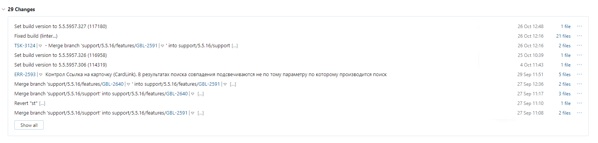
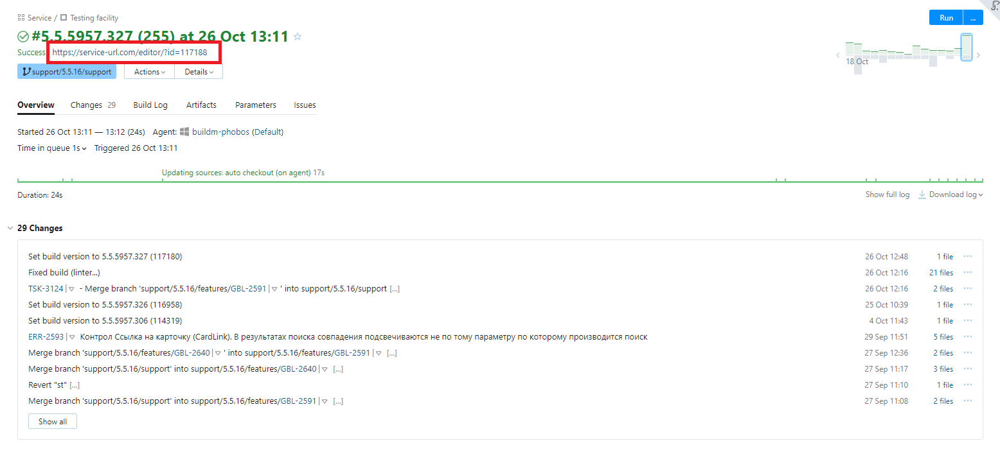

# Конфигурация сайта документации

Полное описание того, как устроена новая документация: от требования до текста на сайте.

- Требование
- Документирование
- Коммит
- Тимсити подхватывает
- Конфигурация тимсити
- Страница патчей
  - С моей стороны
  - Фронт
  - Бэк
- Апплодисменты

Добавить диаграмму в конечный вариант.

## Требование

Всё начинается с требования, которое переходит на документацию. Я беру его в работу, читаю, начинаю документировать.

## Документирование

Я пишу документацию в формате AsciiDoc. На эту тему уже был митап.

Открываю окно IDE, при необходимости создаю новую страницу.

## Коммит

Когда я заканчиваю документировать, я отправляю изменения в GitHub [репозиторий](https://github.com/Docsvision), что запускает магию, созданную Ваней Кутеповым.  

## Тимсити подхватывает

Тимсити отслеживает изменения в репозиториях и запускает сборку.

## Конфигурация тимсити


## Страница патчей

Страница патчей отличается от других тем, что не создаётся мной. Изменения получаются из базы данных и формируют страницу похожую на страницу документации, но не совсем. 

Как эта страница добавлена на сайт? 

###  С моей стороны

На стороне исходной документации это просто пустая страница даже без заголовка. Всё, что на ней есть - это атрибут, указывающий Анторе использовать специальный шаблон страницы.

Шаблоны страницы создаются в проекте [пользовательского интерфейса](https://github.com/Docsvision/antora-ui-default).

Наглядно структура интерфейса выглядит вот так:

```
- antora-ui-default
  - src/
    - css/
      - base.css
      - body.css
      - main.css
      - nav.css
      - ...
      - site.css
      - vendor/
        - docsearch.min.css
        - docsearch.override.css
        - ...
    - helpers/
    - img/
    - js/
      - vendor/
        - docsearch.min.js
        - medium-zoom.bundle.js
        - highlight.bundle.js
        - ...
    - layouts/
    - partials/
```

Каждому типу файлов отведена своя папка. Нас интересуют папки layouts и partials:

```
- antora-ui-default
  - src/
    - css/
      - ...
      - vendor/
        - patches-override.css
        - patches.min.css
    - helpers/
    - img/
    - js/
      - ...
      - vendor/
        - patches.min.js
    - layouts/
      - 404.hbs
      - default.hbs
      - patches.hbs
    - partials/
      - article.hbs
      - body.hbs
      - head-scripts.hbs
      - head-styles.hbs
      - main-patches.hbs
      - article-patches.hbs
      - body-patches.hbs
      - head-scripts-patches.hbs
      - head-styles-patches.hbs
      - main-patches.hbs
```

Основной шаблон находится в папке `layouts`, он выглядит вот так:

layouts/patches.hbs:

```html
<!DOCTYPE html>
<html lang="ru">
  <head>
{{> head-patches defaultPageTitle='Untitled'}}
  </head>
  <body class="article{{#with (or page.attributes.role page.role)}} {{{this}}}{{/with}}">
{{> header}}
{{> body-patches}}
{{> footer}}
  </body>
</html>
```

Как видно, это почти обычный HTML с добавлением особых тегов для включения других файлов: `{{> body-patches}}`. Эти файлы располагаются в папке `partials` и по большей части так же включают другие файлы. Ключевым является `head-scripts.patches.hbs`:

```html
    {{#with site.keys.googleAnalytics}}
    <script async src="https://www.googletagmanager.com/gtag/js?id={{this}}"></script>
    <script>function gtag(){dataLayer.push(arguments)};window.dataLayer=window.dataLayer||[];gtag('js',new Date());gtag('config','{{this}}')</script>
    {{/with}}
    <script type="module" crossorigin src="{{uiRootPath}}/js/vendor/patches.min.js"></script>
    <script>var uiRootPath = '{{{uiRootPath}}}'</script>
```

Внимание следует обратить на предпоследнюю строчку, которая подключает `patches.min.js`, отвечающий за получение накопительных изменений.

Аналогично устроен файл `head-styles-patches.hbs`:

```html
    <link rel="stylesheet" href="{{{uiRootPath}}}/css/site.css">
    <link rel="stylesheet" href="{{{uiRootPath}}}/css/vendor/patches.min.css">
    <link rel="stylesheet" href="{{{uiRootPath}}}/css/vendor/patches-override.css">
    {{#if env.SITE_SEARCH_PROVIDER}}
    {{> search-styles}}
    {{/if}}
```

Во второй строчке подключается `patches.min.css`, который отвечает за формирование стиля страницы накопительных изменений.

В третьей строчке подключается `patches-override.css`, содержащий все костыли для стилей на этой странице. Файл содержит всего 8 строк.

Вместе файлы `patches.min.js` и `patches.min.css` формируют страницу накопительных изменений.

Пользовательский интерфейс собирается при помощи Gulp. Задача для Gulp описана в `build.js`. В результате сборки получается архив со всеми нужными файлами в нужных местах. 

Но на самом деле эти файлы не лежат в репозитории пользовательского интерфейса. Они формируются из другого проекта, ТимСити отслеживает изменения в этом репозитории, собирает файлы, минимизирует, подкладывает в нужное место на готовом сайте.

Далее я расскажу подробнее о фронтенд-проекте для страницы накопительных изменений и о том, как формируются `patches.min.js` и `patches.min.css`.

###  Фронтэнд, конфигурация

Саша использовал:

- Vue 3
- TypeScript
- Vite
- Quasar
- Pinia?
- pug
- scss

К сожалению, Саша не рассказал, как он это использовал, а только поделился трудностями, с которыми он столкнулся.

Внешним видом занимался наш дизайнер - Саша Волков. Фронтенд пришлось разрабатывать в отрыве от самого сайта, что потребовало дополнительных временных затрат. Но в итоге все наработки пришлось отбросить, потому что страница встраивалась на итоговый сайт с уже готовыми стилями. То есть вначале Саша затратил время на дизайн, а потом на вычищение этого дизайна. Неоптимально.

Помимо этого потребовалось менять пути к файлам иконок, создавать для этого специальный скрипт. Потому что Gulp требует располагать в своих папках.

Самым сложным было получить данные с сервера и преобразовать их в древовидную структуру. Серверные данные были организованы как плоский список, страница должна была быть оформлена красиво с раскрывающимися ветками, сгруппированными по релизам и типам исправлений.

###  Бэкэнд

#### Разработчик запускает сборку модуля DV

Когда разработчик запускает сборку модуля продукта, например, Web-клиента, TeamCity смотрит вошедшие коммиты и извлекает номера задач. Затем TeamCity ищет полученные номера в YouTrack и обращается к ним за описанием.



Следующим шагом TeamCity делает POST запрос, в теле которого передается идентификатор сборки продукта, идентификатор продукта, версия и массив вошедших изменений.

```json
{
  "Id": 117188,
  "ProductId": 1,
  "FileVersion": "5.5.5957.327",
  "Changes": [
    {
      "Title": "ERR-2471",
      "Description": "Диалог атрибутивного поиска. Заменить кебаб на крестик",
      "Type": 1
    },
  ]
}
```

Информация, получаемая из TeamCity хранится в отдельном сервисе. Сервис написан на .NET 6 и работает в контейнере. Он предоставляет API для взаимодействия с данными. Запросы к нему проксируются через сайт документации, который находится с ним в той же сети. Информация хранится в БД SQLite т.к. она не предъявляет высоких требований и подходит для нашего объёма информации.

Метод получения накопительного списка изменений открыт для анонимного доступа, всё остальное закрыто за ключами с разными ролями. Например, TeamCity может только отправлять информацию о том, что собрал, а редактор дополнительно изменять некоторые поля, удалять или добавлять изменения в список.

В контексте сервиса продукт представляет объект, содержащий название и его версию, например, Web-клиент 17 5.5.6326.0, за которым закреплен определенный идентификатор.

Каждое изменение должно иметь тип. Пока что их 5:

```json
0) Заметки (доступны только в редакторе)
1) Исправления
2) Оптимизации
3) Функциональные изменения
4) Изменения в библиотеках элементов управления
```

TeamCity отправляет только 1 - исправления, всё остальное заполняется человеком через редактор https://vzhik.digdes.com/editor/?id=96.



Не всегда получается что-то исправить с первого раза, в истории изменений один и тот же номер YouTrack может встречаться несколько раз и входить в разные сборки. Когда TeamCity делает POST запрос, происходит проверка, не было ли это исправлено в предыдущих сборках этого продукта. Если было, у предыдущих записей меняется тип на Заметка (0), а Исправление (1) остаётся только у последнего.

#### Сборка завершается

После завершения сборки, в TeamCity появляется ссылка на редактор, где можно отредактировать описание исправленных ошибок, полученное из YouTrack. Это позволяет изменить автоматически полученное описание или добавить новые изменения любого типа.

Список накопительных изменений строится в зависимости от статуса сборки. Статус устанавливается вручную через редактор вместе с указанием ссылки на загрузку.

Если сборка была опубликована на портале поддержки, сервис должен включить в него изменения всех предыдущих сборок, до предыдущего с таким же статусом.

Выглядит это так:

```
5.5.99.0 — опубликован
↑ 5.5.98.0
| 5.5.97.0
| 5.5.96.0
| 5.5.95.0
| 5.5.94.0
5.5.93.0 — опубликован
↑ 5.5.92.0
| 5.5.91.0
| 5.5.90.0
| 5.5.89.0
| 5.5.88.0
```

Со страницы сайта документации отправляется GET запрос, передающий идентификатор продукта. В ответ приходит массив опубликованных на портале поддержки сборок, в которые включены изменения всех промежуточных, выданных в рамках ТП.

Цепочка сборки документации состоит из 5 конфигураций:
Patches -> UI bundle -> Playbook -> Deployment -> Composite

- **Composite** - запускает цепочку сборки конфигураций, отслеживает изменения в репозиториях документации.
- **Patches** - собирает страницу со списком накопительных изменений.
- **UI bundle** - собирает архив с ресурсами пользовательского интерфейса, забирает артефакты из предыдущей конфигурации.
- **Playbook** - собирает сайт, используя **Patches** и
  **UI bundle**.
- **Deployment** - обновляет сервис в стеке, заменяет контейнер с nginx, в котором лежит собранный сайт.

При запуске проверяются изменения в нижестоящих конфигурациях. Если какую-то конфигурацию можно не собирать повторно, она собрана не будет.

Если коммит был только в репозитории с документацией, то первые конфигурации не запускаются, запускается только сборка сайта с использованием уже собранного архива с ресурсами (UI bundle, Patches).

Если коммит был в первый репозиторий в цепочке, то собирается всё снизу вверх.

Цепочка запускается на коммиты в любой репозиторий с задержкой в 1 минуту. Если в течение минуты не было новых коммитов, то запускается сборка с выкладкой сайта на наш внутренний ресурс.

Во время деплоя, при обновлении сервиса в стеке, одновременно активны две версии сайта. Если новый контейнер работает стабильно и не падает, старый останавливается. В случае, если что-то пошло не так, активной остается текущая версия сайта.

## Апплодисменты

Таким образом на сайте появляется самая свежая документация. После этого требование переходит в статус "тестирование документации". Если по результатам тестирования возникают ошибки или замечания, я изменяю документацию, отправляю изменения, и сборка запускается заново.
