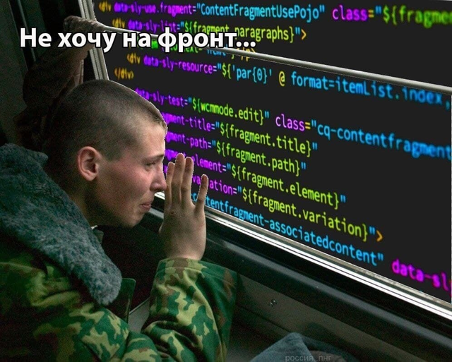
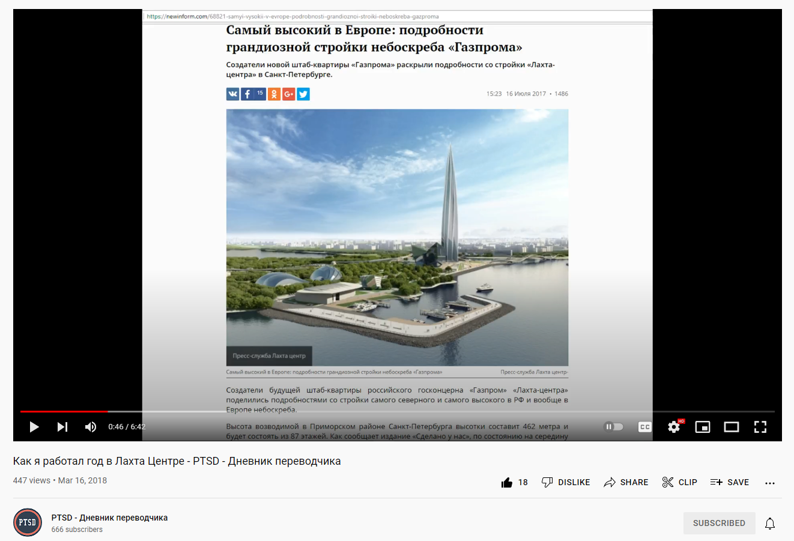

# Docsvision TRD Prod как я не стал фронтэндером, а стал техническим писателем

*Docsvision TRD Prod — это как Toyota TRD Pro, только технический писатель в продакшене. Лол.*

Всем привет! Меня зовут Владимир Маркиев, но вы можете звать меня просто Авксентий Цезаревич. Я работаю техническим писателем в компании Docsvision, люблю документацию и представляться чужими именами в статьях на хабре.

У меня гуманитарное образование переводчика, а опыт работы техническим писателем составляет всего два года (и то неполных). Я хочу рассказать, как можно войти в IT с гуманитарным образованием и насколько это тяжело.

О чём пойдёт речь:

Я разделю статью условно на две части: в первой задам контекст, расскажу, какое у меня образование, а во второй поделюсь взглядом на профессию и коллег со стороны.

- Почему выбрал гуманитарное образование, а не сразу пошёл в IT
- Кем работают гуманитарии
- Что ждёт в IT (увольнение через месяц)
- Кто такой технический писатель пис и айтишник ли он
- Взгляд на коллег и компанию
- Боли технического писателя

*Docsvision TRD Prod = **T**echnical w**R**iter **D**ays in **Prod**uction в компании Docsvision. Даже не спрашивайте, как моё воображение породило эту аббревиатуру.*

## Почему гуманитарное образование

Я закончил простую сельскую школу без каки-либо профилей или углублённого изучения чего-либо. Я даже класс не перепрыгивал.

В школе я всегда был более дружен с компьютером, чем с одноклассниками. Когда у нас только появился интернет, я проявлял интерес к фронтэнд-разработке. Тогда написал свой сайт, используя шаблоны HTML и CSS. Добавил туда свои картинки и текст. На сайте даже была отдельная страница про НЛО в чёрно-зелёных тонах.

Если вы мечтаете о карьере в IT, напрягите память. Если когда-нибудь даже баловались чем-то подобным ради, самое время вспомнить и освежить навык.

Поступи я в 2010 в какое-нибудь ИТМО, сейчас был бы на фронте. Ну, фронтэндером в смысле. Но тогда я и не подозревал о существовании IT-сферы, тем более, что этому где-то учат.

Мне всегда нравился английский, я хотел быть переводчиком. Поэтому пошёл в выборгский филиал РГПУ, где из меня сделали филолога. Close enough.

## Кем работают гуманитарии

Вопреки расхожему мнению не все гуманитарии работают на кассе в Мак.. Вкусно — и точка.

Моей первой работой был Лингваториум — это такой проект, который позволяет научиться английскому при помощи разнообразных автоматически сгенерированных упражнений. Лингваториум был создан и продвигался моим научным руководителем — Клепиковой Татьяной Альбертовной. Я помогал добавлять примеры в те самые упражнения за небольшую плату.

На самом деле даже из такого опыта можно сделать резюме айтишника. Всё зависит от того, как подать опыт. Можно сказать: "я создавал упражнения для студентов", а можно: "мне потребовалось разобраться со сложной системой и адаптировать контент для работы в лингвистическом тренажёре". Выглядит как стандартный совет по составлению резюме, но это правда работает. Для начала карьеры — идеально.

Потом я поступил в ФИНЭКовскую магистратуру на перевод, подрабатывая фриланс-переводами. Едва ли можно заработать на фриланс переводах что-то достойное, но я не сдавался.

Через два года я закончил магистратуру, поступил в аспирантуру, но взял академ, потому что нашёл отличную работу переводчиком. Переводил техническую документацию на стройке Лахта-центра.

Проработал в токсичной и абьюзерской атмосфере год, после чего ушёл.

Для резюме технического писателя такой опыт — это шикарная строчка. Если вам на профессиональном пути потребуется создавать документацию по ГОСТ с отступами и полями, то вы будете ознакомлены с требованиями, с языком и основной структурой. Даже если документация была не для IT-продукта, опыт работы со сложными текстами всегда будет плюсом.

И тогда я запустил свой [ютюб-канал](https://www.youtube.com/channel/UC_n20vgzZheV8dLhOfzlczA) про переводческую деятельность с настолько плохим качеством графики, что это было не так и плохо.

Как можно понять из названия канала, я всегда любил странные аббревиатуры, которые на первый взгляд кажутся чем-то знакомым.

Аспирантуру я так и не закончил. Поработал годик в одной компании менеджером по ВЭД (импорт товаров из-за границы), но по сути мои обязанности сводились к переводу видеоконференций и писем от иностранных партнёров.

Брошенная аспирантура может плохо сыграть в резюме. Если спросят, лучше сказать честно "мне не понравилось, что акцент не на науке, а на преподавании науки".

## Что ждёт в IT (увольнение через месяц)

После увольнения с предыдущей работы у меня случился кризис, я думал, что я ни к чему не пригоден. Но мне нравилось переводить технические тексты, всегда нравилось разбираться в деталях.

Как-то раз за беседой с одним знакомым прозвучала фраза "а ты не думал стать техническим писателем, тебе бы подошло". Я загорелся идеей, начал читать, изучать вакансии, требования. Но никто не отвечал на мои отклики.

Не стоит бросать попытки, если отклики не приносят результата. Максимально спрашивайте обратную связь. Каждый ответ помогает понять, на что следует обратить внимание. Если совсем нет ответов на отклики, стоит подумать о том, чтобы получить новые навыки, подтянуть существующие или найти родственную профессию на время.

Я решил пойти в копирайтеры, это же почти то же самое, что технический писатель (нет). Не знаю, что меня дёрнуло. Компания на фасад выглядела классно: современный открытый офис, приятные рабочие места. Ну всё! Теперь я в айти, кругом разработчики, а я буду крутиться среди них и тоже стану крутым.

Проблемы начались сразу при оформлении:

- Серая на 2/3 зарплата, к тому моменту я устал от серой з/п.
- Оформить не могли неделю, тянули с подписанием документов.
- Задачи и обязанности не были понятны. Не было вводного инструктажа, не было понятно, для чего я делаю свою работу и где посмотреть результат.

Я креативил и генерил идеи изо всех сил... на протяжении одного месяца. А потом меня уволили без объяснения причин. Об увольнении я узнал по "третьей зарплате" за месяц с подписью "расчёт при увольнении". Первая попытка стать айтишником провалилась.

Ещё одна строчка, которая не украсит резюме. Во-первых, можно её не указывать, потому что это слишком маленький период. Во-вторых, всегда можно объяснить причину. В-третьих, обязательно использовать этот опыт в свою пользу. Я работал с YouTrack, Markdown, работал с IT-продуктом и писал околоайтишные тексты как, например, политика использования персональных данных.

Когда меня уволили из той компании, я решил заняться своим портфолио и по-настоящему углубиться в изучение профессии техписа. Я нанялся к Selectel по договору ГПХ писать технические статьи. Это тройной профит: таким образом я повышал свою подкованность в сфере информационных технологий, нарабатывал портфолио и подрабатывал. Писал про сетевую модель, про гит, LVM.

Также я создал [свой сайт](https://vladimir-markiev.name/), написал его с нуля на простом HTML и CSS. Гораздо лучше, чем мой первый сайт, когда я учился в школе.

Первая версия сайта выглядела похуже, это уже вторая редакция, но и она уже не актуальна и не устраивает меня. Сделать третью всё руки не доходят.

Такая подготовка повышает шансы быть замеченным. Упорная работа над собой помогла мне получить сразу несколько офферов.

## Кто такой техпис, он вообще айтишник?

Технический писатель создаёт документацию для IT-продуктов. Техпис может создавать документацию, например, в ворде или использовать специальные инструменты, языки разметки и прочее.

Может показаться, что это какая-то ерунда, но, чтобы заниматься документацией, нужен особый склад ума и характера. Нужно уметь общаться на языке разработчиков и создавать из этого документацию.

Технический писатель — это профессия на стыке, она во многом сходна с переводческой деятельностью. Технический писатель должен не только понимать, что говорят разработчики, но и уметь ставить себя на место простого пользователя, администратора или даже разработчика. То есть как минимум понимать код — обязательное требование. Некоторые техписы также тестируют соответствие документации реальности.

К сожалению, образование технического писателя нельзя получить в каком-то официальном ВУЗе. Можно либо пройти обучение на платных курсах, либо самостоятельно прийти в профессию.

Из нескольких предложений выбирать сложно: а вдруг то другое, которое не выберешь, окажется лучше. Я выбрал Docsvision и не промахнулся. Компания уже прошла путь от документации в ворде и теперь всё по-взрослому:

- docs as code в формате DITA
- исходники загружаются в git
- DITA-файлы конвертируются в PDF
- открытость к экспериментам

На собеседовании спросить про docs as code, текущий формат документации, а также git будет очень кстати. Спрашивать про эксперименты, естественно, плохая идея.

Не прошло и года, как мне поставили задачу исследовать возможность перевести документацию в новый формат. Сделать разделение на версии, вывести в онлайн, прикрутить свквозной поиск.

Что из этого получилось, я уже писал в предыдущих статьях:

- Как я переносил документацию из DITA в AsciiDoc+Antora ([1 часть](https://habr.com/ru/post/589457/) и [2 часть](https://habr.com/ru/post/592477/)).
- Сравнивал [возможности DITA и AsciiDoc](https://habr.com/ru/post/657977/).
- [Улучшал](https://habr.com/ru/company/docsvision/blog/693832/) навигацию для сайта.

## Общение с коллегами

Из личного опыта я сделал вывод, что и в сфере ИТ можно встретить неадекватных людей, но коллеги, как правило — люди более открытые.

В DV крутым оказался не только подход к документации, но и сотрудники. По сравнению с любым коллективом, семья коллег Docsvision — это большой контраст. Все относятся друг к другу с дружелюбием и уважением. Любой сотрудник может обратиться к любому и получить адекватный ответ, без агрессии или подтекста.

Человеку без опыта разработки, коллеги-разработчики могут показаться олимпийскими чемпионами. За спринт успевают написать код, объединить фронт и бэкэнд, а потом представить наработки всему отделу или всей компании.

## Боли технического писателя

У нашего продукта более двух тысяч страниц документации, включая руководства по установке, использованию и описание API.

Есть мнение, что технический писатель должен знать продукт наизусть и даже уметь проверить написанное на достоверность. 

Всё о системе знает только системный архитектор, многое нельзя проверить без специальной настройки или, не заходя в код. Я же проверяю только то, что получается, когда делаю скрины для документации. Тестированием документации занимается команда тестировщиков.

Бывает немного обидно, когда кто-нибудь сообщает об ошибке в документации. Научиться воспринимать такие ошибки как потенциал для улучшения, а не как что-то личное, бывает сложно. Коллеги могут найти ошибки как в недавней документации, которую писал я, так и в довольно старой, которую писал не я.

Среди ошибок в документации можно выделить следующие:

- опечатки (предлог задублировался или остался после переформулировки)
- грамматические (бес попутал, в результате слово не так написал)
- пунктуационные (лишние или недостающие тире, запятые)
- смысловые (неправильная ветка реестра для настроек кэширования)

Бывает и так, что я сам нахожу ошибки или опечатки.

Я уже предвкушаю, как какой-нибудь комментатор пишет "как можно выпускать документацию с ошибками, это отвратительно". Всякое бывает, не то чтобы это критичные ошибки, учитывая, что появляются они несколько раз в месяц.

## Вместо итога

Сменить область деятельности просто так сложно. Путь от гуманитарного образования до сферы информационных технологий может быть сложным и требовать работы над собой, над складом мышления, выбирать свою нишу методом проб и ошибок. Но старания оправданны, если это именно то, чего вы хотели достичь.

Разумеется, мне интересно программирование, я хочу выучить хотя бы Javascript на базовом уровне, но и профессия технического писателя мне тоже очень нравится. Я не разочаровался в своём выборе.

А с каким образованием вы пришли в IT? 

P.S.

Есть такой стереотип, что все айтишники носят бороды. Но я не видел таких стереотипичных айтишников с бородой у нас в компании ли в других. Да и у самого борода как не росла раньше, так и не начала расти теперь.