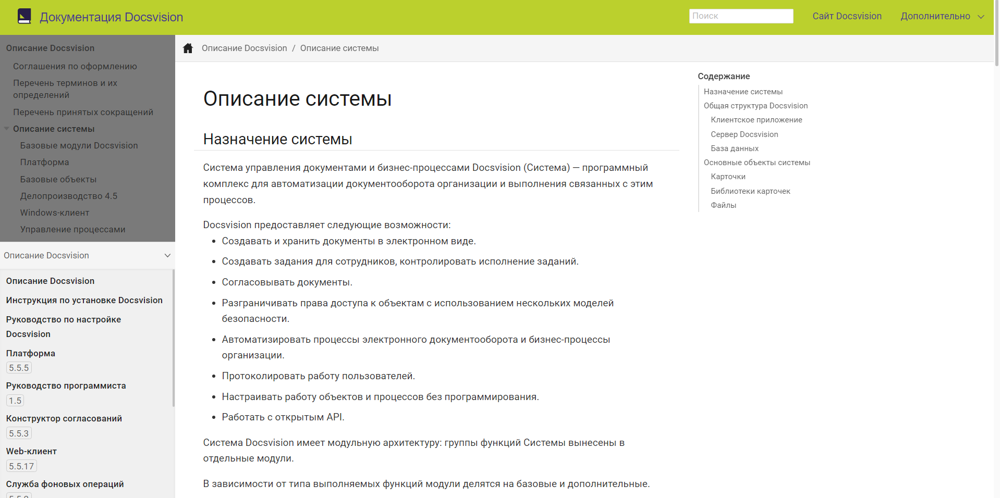
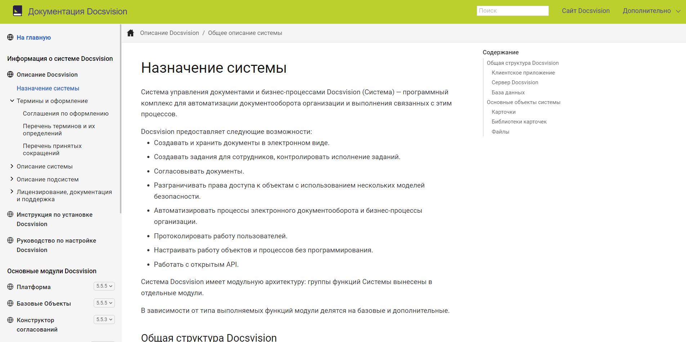
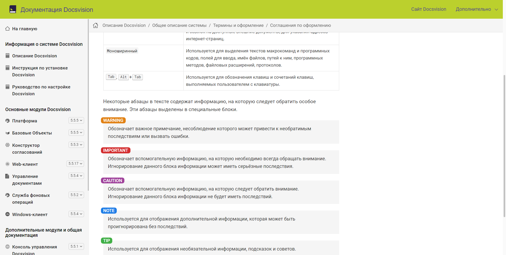

# Как сделать единую навигацию для Antora

Привет! Меня зовут Владимир, но вы можете звать меня просто Иннокентий Алексеевич. Я работаю техническим писателем в компании Docsvision и люблю эксперименты. Я расскажу, как можно улучшить навигационное меню на сайте документации. В качестве примера возьму сайт документации, собранный при помощи Antora.

Antora — генератор статических HTML сайтов из исходных AsciiDoc файлов. Antora бесплатная и имеет открытый исходный код.


Во-первых, зачем вообще нужен сайт документации? Можно пойти дальше и спросить, зачем вообще нужна документация? Этим вопросам посвящено много статей, в том числе и на хабре. Документация повышает привлекательность вашего продукта для потенциальных клиентов. Сайт документации облегчает доступ к этой документации, соответственно, делает продукт ещё более привлекательным.

Ранее я уже писал несколько статей про документацию и AsciiDoc: как я переносил документацию из DITA в AsciiDoc+Antora ([1 часть](https://habr.com/ru/post/589457/) и [2 часть](https://habr.com/ru/post/592477/)), сравнивал [возможности DITA и AsciiDoc](https://habr.com/ru/post/657977/).

## О чём пойдёт речь?

- Зачем улучшать навигационное меню
- Расширения Antora, расширение Antora Navigator
- Работа с шаблонами .hbs, изменение UI
- Работа с CSS-стилями навигации
- Украшаем навигационное меню иконками
- Ковыряемся в SVG и пытаемся наконец всунуть эти иконки

## Зачем улучшать навигационное меню

Лучшее — враг хорошего. Зачем вообще пытаться улучшить то, что и так работает?

Стандартное навигационное меню Antora из коробки простое и функциональное: в навигации слева отображается текущий компонент, под основным меню располагается меню выбора других компонентов и их версий.

Старый вид навигационного меню:



Несмотря на всю простоту такого подхода, у него есть существенные недостатки:

- Пользователю нужно прокручивать основное навигационное меню при просмотре текущего компонента и раскрывать второе меню, чтобы выбрать нужный компонент или версию. Много нажатий, много прокручиваний.
- Самый главный недостаток — навигационное меню создаётся для каждой страницы и прописывается в её исходный HTML. Это увеличивает размер страницы, размер сайта, время на разворачивание. И вообще это не оптимально - зачем делать одно и то же сотни раз?

## Расширения Antora

В Antora версии 3.0 появилась возможность использовать пользовательские расширения. Раньше для реализации любой фичи требовалось делать форк Анторы:

- Форк, чтобы прикрутить поиск Lunr.
- Форк, чтобы создавать pdf и т.д..

Благодаря расширениям любые изменения стали значительно проще. Теперь менять исходный код Анторы не нужно, достаточно просто установить расширение в репозиторий playbook одной командой:

`npm i @antora/pdf-extension`

И зарегистрировать его в antora-playbook.yml:

```yaml
antora:
  extensions:
  — '@antora/pdf-extension'
```

При необходимости можно выполнить персонализацию расширения. Обычно это выполняется по приложенной к расширению инструкции.

### Antora Navigator Extension

С расширением Навигатора немного сложнее. Это расширение ещё не опубликовано официально, поэтому нужно копировать весь [репозиторий](https://gitlab.com/opendevise/oss/antora-navigator-extension/-/tree/main) и вносить изменения в пользовательский интерфейс сайта.

Алгоритм следующий:

1. Клонировать [репозиторий](https://gitlab.com/opendevise/oss/antora-navigator-extension/-/tree/main) Навигатора как подмодуль репозитория antora-playbook.
2. Репозиторий Навигатора содержит символические ссылки, поэтому из-под Windows клонировать нужно вот так: `git clone -c core.symlinks=true https://gitlab.com/opendevise/oss/antora-navigator-extension/-/tree/main`, из-под Linux можно клонировать стандартным способом.
3. В antora-playbook.yml добавить следующие строки:
   ```yaml
   antora:
     extensions:
     — require: ./antora-navigator-extension/
       config_file: ./antora-navigator.yml
   ```
4. При необходимости можно настроить файл `antora-navigator.yml`. Как это сделать, будет описано в README репозитория Навигатора, когда мой merge request будет одобрен. Если ждать не хочется, я уже обновил READE в [нашем (Docsvision) репозитории](https://github.com/Docsvision/antora-navigator-extension) с форком расширения.
5. Выполнить необходимые изменения в UI.

## Работа с шаблонами .hbs, изменение UI

Пока расширение в ранней стадии разработки, нужно ещё немного повозиться с UI.

1. Во-первых, нужно скопировать папку `example/supplemental-ui` из репозитория Навигатора в свой репозиторий playbook.
2. Если вы используете UI, производный от дефолтного, потребуется перенести все изменения из supplemental_ui в ваш основной. Ну или наоборот — из основного в supplemental.
   
   Это касается файлов в папке `example/supplemental-ui/partials`(.hbs). Следующие строки из supplemental_ui нужно будет добавить в основной файл `footer-scripts.hbs`:
   
   ```html
   <script src="{{{siteRootPath}}}/site-navigation-data.js"></script>
   <script src="{{{uiRootPath}}}/js/nav.js"></script>
   <script src="{{{uiRootPath}}}/js/site.js"></script>
   ```
   
   При необходимости аналогичным образом отредактируйте файлы `head-meta.hbs` и `nav.hbs`.
   
   По тому же принципу поступите с файлами в папках `js` и `сss`.
   
   Это можно не делать, если вы не меняли файлы в пользовательском интерфейсе. Мы перенесли из `supplemental-ui` в основной всё из файлов .hbs, но не трогали .js и .css.
3. Отредактируйте `nav.js`, чтобы заменить английский в названии версий и внести другие изменения.
   
   Локализовать или изменить эти значения можно в следующих строках `nav.js`.
   
   - На главную — строки 133 и 134.
   - Последняя версия — строка 243.
   - Предрелизные версии — строка 245.
   - Предыдущие версии — строка 247.
   
Работёнка выглядит немного запарной, но результат того стоит:



Кроме единого навигационного меню без лишних панелей, расширение Навигатора предоставляет:

- Удобную навигацию по версиям через выпадающий список с подписями "Последняя версия", "Предрелизная версия".
- Общий размер сайта сокращается более чем на 50% из-за того, что навигация формируется не при помощи HTML, а с помощью JavaScript.
- Появляется возможность добавить красивые иконки для компонентов в меню.

## Работа с CSS-стилями навигации

Я также подумал, что стоит изменить стиль навигационного меню. Вместо подчёркивания при наведении сделать выделение цветом, убрать подчёркивание и т.д.

Это легко сделать всего несколькими строками CSS:

```css
a.nav-text:hover {
    text-decoration: none;
    color: #4c22f7;
}

a.nav-text:active {
    text-decoration: none;
    color: #4c22f7;
}
```

А ещё хорошо бы выделять текущую страницу чуть ярче, чем просто жирным:

```css
.nav-list [aria-current=page] {
    color: #4c22f7;
    font-weight: normal;
    -webkit-text-stroke-width: 0.02em;
}
```

## Украшаем навигационное меню иконками

Когда я представил новое навигационное меню коллегам на демо, первый вопрос был "А можно изменить иконки на собственные?"

Да, можно, но чтобы понять, как это делается, мне пришлось долго курить исходники. Но это, конечно же, потому что я просто недалёкий.

1. Чтобы приделать иконки, нужно сперва вспомнить, что такое компоненты Antora и где определены их названия. Компоненты — это базовая единица Antora. Названия компонентов задаются в файлах antora.yml. Также имена компонентов можно узнать в файле antora-navigator.yml.
   
2. Затем необходимо создать файл icondefs.js:
   
   ```javascript
   ;(function () {
     /* eslint-disable max-len */
     // prettier-ignore
     var defs = [
       {
         id: 'icon-nav-component', 
         /* Корневая навигационная группа, а также любой другой компонент, для которого не указана специальная иконка. */
         viewBox: '0 0 30 30',
         path: { d: 'M19.9035 16.7957L22.0559 24.8282C19.8893 25.7545 17.5053 26.2702 15 26.2702C12.4947 26.2702 10.1107 25.7545 7.94414 24.8282L10.0965 16.7957C7.16563 15.0998 5.19232 11.9329 5.19232 8.30324C5.19232 6.65115 5.6026 5.09557 6.32406 3.72984L12.9574 13.2033H17.0426L23.676 3.72984C24.3974 5.09557 24.8077 6.65115 24.8077 8.30324C24.8077 11.9329 22.8344 15.0998 19.9035 16.7957Z', fill: '#00A2DF' }, 
         /* Иконка для корневой навигационной группы [в формате SVG path](https://developer.mozilla.org/en-US/docs/Web/SVG/Tutorial/Paths). */
       },
       {
         id: 'icon-nav-component-ROOT', <.>
         /* Компонент с именем ROOT (`name: ROOT`) в файле `antora.yml`. */
         viewBox: '0 0 14 15',
         paths: [
           { d: 'M1.36278 0L1.36787 3.94183L7.40742 3.95558L7.40236 0.0376971L8.73519 0.00265382L8.6981 5.27362L0 5.28486L0.0369378 0.0348597L1.36278 0Z', transform: 'translate(2.8598 6.64626)', fill: '#00A3E0' },
           { d: 'M6.00319 0L11.7143 4.23063V5.86337L5.97677 1.61317L0 5.5623L0.137638 3.91056L6.00319 0Z', transform: 'translate(1.198 1.32681) scale(0.999808) rotate(-1.50596)', fill: '#087299' }, 
           /* Иконка для компонента с именем ROOT [в формате SVG path](https://developer.mozilla.org/en-US/docs/Web/SVG/Tutorial/Paths). */
         ],
       },
     ]
     var icondefs = Object.assign(document.createElement('div'), { id: 'icondefs', hidden: true })
     icondefs.appendChild(
       defs.reduce(function (parent, icondef) {
         var symbol = Object.assign(document.createElementNS('http://www.w3.org/2000/svg', 'symbol'), { id: icondef.id })
         symbol.setAttribute('viewBox', icondef.viewBox)
         var contents = icondef.contents || icondef.paths || [icondef.path]
         if (Array.isArray(contents)) {
           contents.forEach(function (props) {
             symbol.appendChild(
               Object.entries(props).reduce(function (tag, prop) {
                 tag.setAttribute(prop[0], prop[1])
                 return tag
               }, document.createElementNS('http://www.w3.org/2000/svg', 'path'))
             )
           })
         } else {
           symbol.innerHTML = contents
         }
         parent.appendChild(symbol)
         return parent
       }, document.createElementNS('http://www.w3.org/2000/svg', 'svg'))
     )
     document.body.appendChild(icondefs)
   })()
   ```
   
3. Файл `icondefs.js` нужно добавить в свой проект пользовательского интерфейса, в папку `src/js/vendor/`.
4. Затем его нужно зарегистрировать в шаблоне `footer-scripts.hbs` следующим образом:

   ```html
   <script src="{{siteRootPath}}/site-navigation-data.js"></script>
   <script src="{{uiRootPath}}/js/vendor/icondefs.js"></script>
   ```
   
   Файл `icondefs.js` должен быть вторым в списке после `site-navigation-data.js`.

## Ковыряемся в SVG и пытаемся наконец всунуть эти иконки

Обычно SVG имеют исходный код следующего вида:

```xml
<svg width="32" height="32" viewBox="0 0 32 32" fill="none" xmlns="http://www.w3.org/2000/svg">
	<rect x="0.5" y="0.5" width="31" height="31" rx="15.5" fill="#F18A00" stroke="white" />
	<rect x="14.5638" y="9" width="1.51276" height="12.2702" fill="white" />
	<path
		fill-rule="evenodd"
		clip-rule="evenodd"
		d="M11.4542 21.2702C13.9143 21.2702 15.9085 19.276 15.9085 16.8159C15.9085 14.3559 13.9143 12.3617 11.4542 12.3617C8.99423 12.3617 7 14.3559 7 16.8159C7 19.276 8.99423 21.2702 11.4542 21.2702ZM11.5383 19.9255C13.2093 19.9255 14.5639 18.5709 14.5639 16.9C14.5639 15.229 13.2093 13.8744 11.5383 13.8744C9.8674 13.8744 8.51282 15.229 8.51282 16.9C8.51282 18.5709 9.8674 19.9255 11.5383 19.9255Z"
		fill="white"
	/>
	<path
		fill-rule="evenodd"
		clip-rule="evenodd"
		d="M24.3128 12.5298H26.1617L22.632 21.2702H22.6319L22.6319 21.2702H20.783L17.2532 12.5298H19.1021L21.7075 18.9811L24.3128 12.5298Z"
		fill="white"
	/>
</svg>
```

Нельзя просто так взять и вставить это в icondefs, потому что здесь сочетаются объекты (фигуры, линии) и пути, а также присутствуют `fill-rule` и `clip-rule`.

Из следующего примера кода можно понять, как приделать `fill-rule` и `clip-rule`, но объекты и пути так сочетать не получится:

```xml
    {
      id: 'icon-nav-component-mgmtconsole',
      viewBox: '0 0 32 32',
      paths: [
        { d: 'M11.4542 21.2702C13.9143 21.2702 15.9085 19.276 15.9085 16.8159C15.9085 14.3559 13.9143 12.3617 11.4542 12.3617C8.99423 12.3617 7 14.3559 7 16.8159C7 19.276 8.99423 21.2702 11.4542 21.2702ZM11.5383 19.9255C13.2093 19.9255 14.5639 18.5709 14.5639 16.9C14.5639 15.229 13.2093 13.8744 11.5383 13.8744C9.8674 13.8744 8.51282 15.229 8.51282 16.9C8.51282 18.5709 9.8674 19.9255 11.5383 19.9255Z', fill: 'white', 'fill-rule': 'evenodd', 'clip-rule': 'evenodd' },
        { d: 'M24.3128 12.5298H26.1617L22.632 21.2702H22.6319L22.6319 21.2702H20.783L17.2532 12.5298H19.1021L21.7075 18.9811L24.3128 12.5298Z', fill: '#271F47', 'fill-rule': 'evenodd', 'clip-rule': 'evenodd' },
        { d: 'M2.21876 7.91919L15.4448 13.3055V28.996L2.21876 22.79V7.91919Z', fill: '#00ADBB' },
        { d: 'M16.1337 2.59143L2.63208 7.04097L16.1337 12.3687L29.4286 7.04097L16.1337 2.59143Z', fill: '#BBD02D' },
      ],
      contents:
        '<rect x="0.5" y="0.5" width="31" height="31" rx="15.5" fill="#F18A00" stroke="white"/>' +
        '<rect x="14.5638" y="9" width="1.51276" height="12.2702" fill="white"/>',
    },
```

Выйти из ситуации можно при помощи Adobe Illustrator или Inkscape. Преобразовать все объекты в пути за два клика по [инструкции](https://bytexd.com/how-to-convert-objects-to-paths-in-inkscape/). 

В результате получится что-то такое:

```javascript
    {
      id: 'icon-nav-component-mgmtconsole',
      viewBox: '0 0 32 32',
      paths: [
        { d: 'M 16,0.5 C 24.587,0.5 31.5,7.413 31.5,16 31.5,24.587 24.587,31.5 16,31.5 7.413,31.5 0.5,24.587 0.5,16 0.5,7.413 7.413,0.5 16,0.5 Z', fill: '#f18a00', stroke: '#ffffff' },
        { d: 'm 14.5638,9 h 1.51276 V 21.2702 H 14.5638 Z', fill: '#ffffff' },
        { d: 'M11.4542 21.2702C13.9143 21.2702 15.9085 19.276 15.9085 16.8159C15.9085 14.3559 13.9143 12.3617 11.4542 12.3617C8.99423 12.3617 7 14.3559 7 16.8159C7 19.276 8.99423 21.2702 11.4542 21.2702ZM11.5383 19.9255C13.2093 19.9255 14.5639 18.5709 14.5639 16.9C14.5639 15.229 13.2093 13.8744 11.5383 13.8744C9.8674 13.8744 8.51282 15.229 8.51282 16.9C8.51282 18.5709 9.8674 19.9255 11.5383 19.9255Z', fill: 'white', 'fill-rule': 'evenodd', 'clip-rule': 'evenodd' },
        { d: 'M24.3128 12.5298H26.1617L22.632 21.2702H22.6319L22.6319 21.2702H20.783L17.2532 12.5298H19.1021L21.7075 18.9811L24.3128 12.5298Z', fill: 'white', 'fill-rule': 'evenodd', 'clip-rule': 'evenodd' },
      ],
    },
```

Запарно, конечно. Самое интересное, что можно было просто взять чистый код SVG и вставить в footer-scripts.hbs вот так:

```xml
    <symbol id="icon-nav-component-mgmtconsole" viewBox="0 0 16 16">
      <path d="m5.345 3.22a0.75 0.75 0 0 1 1.06 0l4.25 4.25a0.75 0.75 0 0 1 0 1.06l-4.25 4.25a0.75 0.75 0 0 1-1.06-1.06l3.72-3.72-3.72-3.72a0.75 0.75 0 0 1 0-1.06z" fill-rule="evenodd"/>
    </symbol>
```



По умолчанию иконки серые, но окрашиваются в цвет при наведении на текст. Причём делают это постепенно.

Это достигается за счёт CSS. Это изменение я придумал в последний момент:

```css
.nav-item:hover > .nav-title .nav-icon {
  filter: grayscale(0);
  opacity: 1;
  transition: .3s;
}

.nav-item:active > .nav-title .nav-icon {
  filter: grayscale(0);
  opacity: 1;
}
```

Теперь у нашего сайта документации есть роскошное меню навигации с красивыми иконками, а ещё на сборку уходит в два раза меньше времени. Сплошные плюсы.

А где сам сайт? Ну, он ещё не опубликован в широкий доступ. Точнее, опубликован, но там старая навигация.
