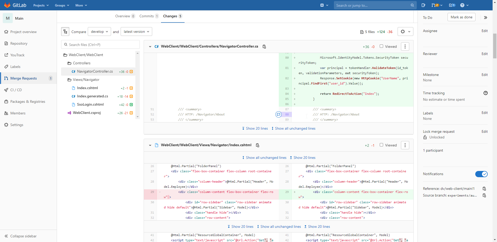

# Реструктуризация производства

Всем лучи добра! Меня зовут Маркиев Владимир, но вы можете звать меня просто Колян. Я работаю техническим писателем в компании ДоксВижн. Что мы разрабатываем, вы можете узнать на [нашем сайте](https://docsvision.com/), а в статье я хочу поделиться тем, как мы один большой отдел производства поделили на несколько команд. Я не буду пересказывать очередную историю успешного успеха, а изложу процесс с моей субъективной точки зрения. Всё перевру, приправлю тупыми шутками и в таком духе.

Как у любой другой компании у нас была своя команда разработки, точнее две больших команды. Одна команда разрабатывала один продукт, другая — второй. Всё шло хорошо, приходили новые разработчики, команды постепенно разрастались, и к какому-то моменту стало понятно, что большие команды только усложняют процесс разработки и делают взаимодействие неудобным. Когда одни и те же ошибки исправляются по несколько раз разными людьми — это субоптимально. Также субоптимально, когда на утреннем стендапе 22 человека и пятиминутный разговор о проблемах выливается в получасовой сеанс психотерапии для одного-двух разработчиков. Так мы решили перейти от проектных команд к кросс-функциональным командам. Сейчас всё поясню.

TRIGGER WARNING: Прежде, чем я начну, прошу вас подготовиться к неожиданностям при прочтении статьи. Если текст кажется вам переполненным сарказмом, пожалуйста, не относитесь к нему слишком серьёзно. Если текст вас оскорбляет, не читайте его. Спасибо!

## Сам понял, что сказал?

Сложное слово "кросс-функциональные" означает всего лишь, что все команды занимаются всем понемногу. Таким образом каждая команда выполняет задачи из разных проектов и владеет знанием обо всём продукте, а не только о его части. Почему так важно, чтобы каждый знал чуть-чуть обо всём, думаю понятно, но на всякий случай поясню:

- Каждый разработчик видит код разных проектов и немного понимает "как это устроено".
- Если кто-то заболел, ушёл в отпуск или уволился (и такое случается), кто-то другой подхватит его работу.
- Все вместе делают продукт, а не отдельную его часть.

Недолго думая, мы решили организовать встречу в лучших традициях демократии, где каждый может сам выбрать, что ему нравится больше всего. Встречу провели, конечно же, онлайн. Не все сейчас ходят в офис, да и офисы у нас в двух разных городах. Кто-то даже впервые показал своё истинное лицо. Не только аватарку, в смысле. Все дружно перешли по ссылке в Miro, где наш заботливый руководитель Денис заранее подготовил стикеры, на которых каждый записывал, чем он хочет заниматься.

Затем всем было предложено занять место за четырьмя столами. Столы были виртуальные, поэтому закусок не предполагалось, зато каждое место было подписано в духе "frontend-разработчик", "backend-разработчик", "бизнес-аналитик", "~~тестировщик~~", ой, простите, "QA-инженер", "технический писатель". Три обычных команды и одна типа сервисная — помогает другим и координирует работу. Всё потому, что бизнес-аналитиков у нас пока не так много да и технический писатель всего один (это я. Привет, мам!).

Где-то после этого была ещё встреча для каждой команды, где они долго и в лучших традициях древнегреческих мудрецов рассуждали о том, кто же должен быть "тимлидом", а кто должен ходить на общекомандные встречи и почему это могут быть разные люди. 

После разделения каждая команда обладает всеми необходимыми атрибутами успешного коллектива:

- Дурацкие названия: Вжик, Горыныч, БЭМС (Боевые, Энергичные, Молодые, Симпатичные), Звёздочка
- Логотипы из картинок, найденных в интернете
- Командный дух, компетенции и опыт

## Передел YouTrack

Команды есть, теперь надо как-то работать. Работаем мы в YouTrack, точнее с его помощью. Да-да, я знаю, что Agile, спринты, ежедневные стендапы и вот это всё от зарубежного диавола и вообще никому не надо. Если вы согласны, то пропускайте этот раздел и идите ~~лесом~~ дальше по статье.

Постараюсь кратко и на пальцах. Раньше у нас был один общий ютрек: все задачи в одной куче, которая распределялась нашим многозадачным руководителем Денисом. Теперь у нас по-прежнему один общий ютрек, но задачи распределяет маленький избранный народом тимлид.

Раньше каждые две недели мы планировали один общий спринт, на котором можно было просадить полтора часа времени, а теперь команды планируют спринты сами. А могут вообще отказаться от всего лукавого аджайла и планирования, если так проголосуют. Профит в том, что теперь на планирование тратится значительно меньше времени и нервов.

Мне так вообще в планировании не надо участвовать. А смысл? Всё равно каждое требование я потом должен буду задокументировать, вот я и документирую, а не планирую.

Раньше в ютреке было два проекта: платформа и web-клиент. Теперь у нас есть общие задачи производства, которые могут включать любой проект. Были задачи типа WebC и задачи DV5, а стали просто TSK (может быть как WebC, так и DV5, так и вообще что угодно). Раньше ошибки записывались как обычная задача, а теперь в специальную задачу типа ERR. Видишь заголовок и сразу понимаешь, где собака зарыта.

У каждой такой задачи есть поле "команда", в котором указаны ответственные. Приходишь такой в требование, смотришь, кто ответственный, сразу знаешь, на кого наехать, чтобы узнать инфу.

А ещё у меня появился свой тип TSK-задачи — задание на документацию. У моих особых задач нет ревью и тестирования, они сначала открыты, потом в работе, потом закрыты. Всё.

## Расскажи ещё, как у вас круто получилось

Работать правда стало намного увлекательнее. Появился чёткий ритм. Утром стендап (5-15 минут)  и обсуждение командных проблем, потом избранные приходят на синхронизацию и рассказывают проблемы на общекомандной встрече (обычно минут 5-7). Каждые две недели ретроспектива (как поработали) и планирование (что будет делать дальше) и общекомандное демо (показать всем, как работает сделанное за 2 недели).  И это не полуторачасовые встречи как раньше, а реально динамичные и полезные события. Мне особенно нравится демо, потому что теперь мне не надо сидеть и втыкать в требования часами, включая воображалку "а что же тут подразумевалось? а как же это задокументировать". Команды всё покажут и объяснят сами!

Ладно, кого я обманываю, всё равно мне приходится втыкать в требования часами, потому что я тупой.

Команды стали максимально автономными и независимыми. Они не ограничены ничем кроме достижения поставленной цели — выпуск продукта. В своих маленьких коллективах коллеги разработали свои методики автоматизации, особенные алгоритмы взаимодействия и т.д. Например, в Звёздочке разработали систему ачивок за количество закрытых требований в спринте. Если они закроют XX, YY, NN требований, то получат одну, вторую и третью звёздочку соответственно. Причём именно полностью закроют, включая документацию. На вопрос "а что если я не успею задокументировать их требование, и оно не будет закрыто", мне ответили, что могут вежливо попросить меня поторопиться. Что даёт мне некоторую власть над целой командой. Власть опьяняет.

В любом случае получилось классно! Демократичность, открытость и самостоятельность — вот как бы я охарактеризовал нынешний процесс. 

## Гонишь, не может всё быть так гладко

Может и гоню, но совсем чуть-чуть. Вот настолько:

Дело в том, что у нас в компании налажено ревью кода. Это когда один разработчик приходит к другому и говорит: "смотри, какой классный код я сделал!", а второй ему отвечает: "почитай чистую архитектуру Мартина, тогда поговорим".

Короче, у нас было несколько вариантов организации ревью, и мы не знали, какой из них выбрать:

1. Итеративное ревью.

   - Взяли задачу. Ответвились, сделали доработки по фронту и по бэку.

   - Перед передачей на приёмку бизнес-аналитику делаем ревью фичи целиком. Заодно подмержили develop.

     (Есть мнение, что разработка в отдельных ветках — это прошлый век. Вот и пусть будет.)

   - Сделали хорошо, довели ревью до одобрения и передали на приёмку.

   - Если нужна доработка, повторяем предыдущие пункты.

   - Если доработка не требуется, передаём на тестирование.

   - Проводим багфикс.

   - Когда готовы, делаем ревью изменений по багфиксу в целом, обратный мерж и вливаем в develop.

   Всё просто, видите:

   

   В таком случае ревью будет чуть масштабнее и сложнее, но делать его нужно будет реже. Одна команда сможет ревьюить другую, будет коллективное владение кодом, дети в Африке не будут голодать и будет рай на Земле. Только не спрашивайте, как это работает, моё дело — рассказать.

1. Ревью через merge-реквесты. Работает вот так:

   - Один разработчик написал код и перевёл его на ревью.

   - Автоматически создаётся отдельная ветка и назначается ревьюер.

     Ревьюер должен обладать теми же знаниями, что и автор кода. Ну, типа клиентский разработчик не может ревьюить серверного, сишарпер не может ревьюить джаваскриптера и т.д.

   - В этой ветке коллеги обсуждают чистоту архитектуры, а затем ветка мержится в девелоп, и все довольны.

   - Можно организовать сразу через гитлаб, минуя upsourсe, в котором всё делалось до разделения.

Знаете, какой вариант мы выбрали? Никакой!

Код-ревью делается по каждой задаче или ошибке по возможности внутри команды. Если это не возможно, то кросс-командно. Ревью создаётся по коммитам для задачи или ошибки в любой ветке.

## Неудобные вопросы после разделения на команды

- Как будет проходить регресс?
  - **Ожидание:** Все задачи регресса будут равномерно распределяться по командам. Или одна команда делает большую часть, а другие помогают.
  - **Реальность:** После разделения мы ещё не дошли до регресса, поэтому практического подтверждения нет.
- Кто будет брать случайно найденные ошибки из общего чата?
  - **Ожидание:** Под индивидуальную ответственность. Нашли, записали, а дальше задачу в работу берёт та команда, которой задача больше нравится. Или в зависимости от загруженности.
  - **Реальность:** Всё так и работает. До сих пор не было проблем.
- Как будут распределяться дежурства по ТП?
  - **Ожидание:** Очень просто. Дежурят не команды, а дежурят люди. Если загруженность по ТП большая, можно подключать людей из других команд. Если загруженность небольшая, то дежурные могут совмещать дежурство с повседневными задачами.
  - **Реальность:** В целом всё так. В крайнем случае особенно большой загруженности можно забить на SLA и решать задачи в комфортном темпе. Но это неправильно и мы так не делаем, конечно же. Честно-честно. 
- И как полёт сейчас, спустя месяцы?
  - **Ожидание:** Никто не ожидал, что команды будут статичными.
  - **Реальность:** Кто-то ушёл, кто-то пришёл, кто-то перевёлся из соседнего отдела. Бизнес-аналитиков набралось на все команды по одному, как и задумывалось. Но есть некоторый недостаток разработчиков.

## Выводы

Короче, разделение на команды — это прикольно и совсем безболезненно. Как ни странно, но после разделения мы узнали друг о друге больше, чем до этого. У каждого даже появилась своя карточка с основной информацией о человеке. Типа любимые занятия, почему он тут и к чему стремится. Очень интересно, обожаю такое.

Новичкам теперь легче влиться в небольшую команду, понять процессы и начать работать. Короче, недостаток людей — плохо, избыток — тоже плохо. Если у вас огромная команда и становится сложно управлять процессами, подумайте о разделении, это реально работает.

Хотите в команду? [Откликайтесь на hh](https://spb.hh.ru/employer/692035)!
